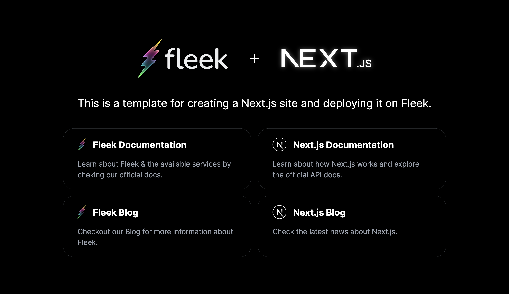

# Next.js + Fleek Starter Kit



## 🚀 Project Structure

Inside of your Next.js project, you'll see the following folders and files:

```
/
├── public/
│   └── favicon.svg
├── src/
│   └── app/
│       ├── favicon.ico
│       ├── globals.css
│       ├── layout.tsx
│       └── page.tsx
├── next.config.js
├── tailwind.config.js
├── tsconfig.json
└── package.json
```

If you want to lern more about the `app` router you can checkout [Next.js documentation](https://nextjs.org/docs/app/building-your-application/routing#the-app-directory).

Any static assets, like images, can be placed in the `public/` directory.


## 🧞 Commands

All commands are run from the root of the project, from a terminal:

| Command                | Action                                           |
| :--------------------- | :----------------------------------------------- |
| `pnpm install`          | Installs dependencies                            |
| `pnpm run dev`          | Starts local dev server at `localhost:3000`      |
| `pnpm run build`        | Build your production site to `./out/`          |
| `pnpm run start`      | Preview your build locally, before deploying     |
| `pnpm run lint ...`    | Run Linter |

## ⚡ How to deploy to Fleek

### 1. Create a `fleek.json` config file:
You can configure this site deployment using [Fleek CLI]() and running:
```
 > fleek sites init
   WARN! Fleek CLI is in beta phase, use it under your own responsibility
   ? Choose one of the existing sites or create a new one. › 
   ❯ Create a new site
```
It will prompt you for a `name`, `dist` directory location & `build command`
- `name`: How you want to name the site
- `dist`: The output directory where the site is located, for this template it's `out`
- `build command`: Command to build your site, this will be used to deploy the latest version either by CLI or Github Actions

### 2. Deploy the site
After configuiring your `fleek.json` file, you can deployt the site by running

```
fleek sites deploy
```
After running it you will get an output like this:
```
 WARN! Fleek CLI is in beta, use it at your own discretion
 > Success! Deployed!
 > Site IPFS CID: QmP1nDyoHqSrRabwUSrxRV3DJqiKH7b9t1tpLcr1NTkm1M

 > You can visit through the gateway:
 > https://ipfs.io/ipfs/QmP1nDyoHqSrRabwUSrxRV3DJqiKH7b9t1tpLcr1NTkm1M
 ```

### Extra features
- **Continuous Integration (CI):** `fleek sites ci` [Documentation.](https://docs.fleek.xyz/services/sites/#continuous-integration-ci)
- **Adding custom domains:** `fleek domains create` [Documentation.](https://docs.fleek.xyz/services/domains/)


### Keep in mind:

This template has been configured to produce a static output.

```js
/** @type {import('next').NextConfig} */
const nextConfig = {
  output: 'export',
  reactStrictMode: true,
  images: {
    unoptimized: true,
  },
  trailingSlash: true,
}

module.exports = nextConfig

```

You can find more information about static builds in [Next Documentation](https://nextjs.org/docs/app/building-your-application/deploying/static-exports#configuration)


## 👀 Want to learn more?

Feel free to check [Next.js documentation](https://nextjs.org/docs) or jump into Next.js [learning platform](https://nextjs.org/learn/foundations/about-nextjs?utm_source=next-site&utm_medium=nav-cta&utm_campaign=next-website).

